# Software Requirements Specification (SRS)

## GrantFinder AI: Intelligent Scholarships & Innovation Grants Discovery Platform

Document Version: 1.0.0  
Status: Approved Baseline  
Standard: IEEE 830-1998 / ISO/IEC/IEEE 29148  

---

## 1. Introduction

### 1.1 Purpose
This Software Requirements Specification (SRS) establishes the complete functional and non-functional requirements for the **GrantFinder AI** platform. It provides the definitive technical specification governing system architecture, data models, external integrations, security controls, and user interface workflows.

### 1.2 Document Conventions
* **FR:** Functional Requirement
* **NFR:** Non-Functional Requirement
* **UC:** Use Case Specification
* **RBAC:** Role-Based Access Control
* **JWT:** JSON Web Token
* **PBKDF2:** Password-Based Key Derivation Function 2
* **Priority Levels:** High (Mandatory for release), Medium (Standard capability), Low (Future enhancement).

### 1.3 Intended Audience
This specification is designed for software architects, backend and frontend engineers, QA test specialists, and systems security auditors implementing and verifying the GrantFinder AI platform.

### 1.4 Project Scope
GrantFinder AI is an automated, AI-assisted funding discovery platform. It eliminates manual searching across fragmented university websites, government repositories, and private foundation lists. Users configure an academic or venture profile once, after which the platform combines pre-seeded, curated institutional databases with real-time AI-driven web crawling to discover, match, score, and rank opportunities. It features dual tracks (Scholarships for students, Innovation Grants for student founders), demonstrated freemium monetization, and AI-powered application drafting assistants.

### 1.5 Future Scope (Deferred Enhancements)
* **Phone Number Verification:** SMS / OTP telephone verification is formally deferred to Phase 2 (Future Scope). The current production release authenticates users exclusively via cryptographic Email/Password credentials to maximize onboarding speed and avoid vendor lock-in.
* **Biometric & Institutional SSO:** OAuth 2.0 institutional student single sign-on (EduGAIN / Google Workspace) planned for future institutional pilots.

---

## 2. Overall Description

### 2.1 Product Perspective
GrantFinder AI operates as a self-contained web service utilizing a modular, zero-cost architecture. It interfaces with external web search indexes (Serper.dev), large language model inference APIs (Google Gemini), mail transport services (SMTP), and messaging gateways (WhatsApp Cloud API / CallMeBot).

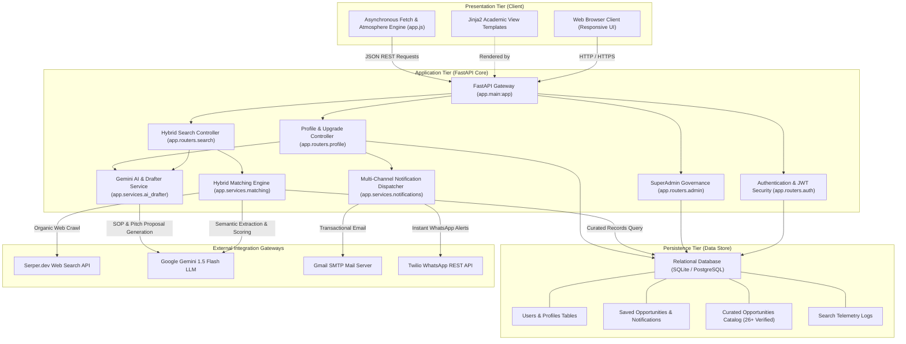

### 2.2 Product Functions
* **Dual Opportunity Tracking:** Contextualized discovery pathways tailored specifically for University Scholarships and Startup Innovation Grants.
* **Hybrid Ingestion Pipeline:** Merges pre-seeded, verified government repositories with dynamic web-crawled discoveries.
* **Semantic Profile Scoring:** Computes mathematical 0-100% relevance scores and contextual bulleted rationales.
* **Freemium Gating:** Delineates free usage (top 3 visible matches) from premium access (unlimited results and AI assistants).
* **AI Application Assistance:** Generates customized Statements of Purpose for scholarships and Executive Pitch Proposals for grants.
* **Multi-Channel Delivery:** Orchestrates persistent in-app notifications, transactional email alerts, and instant WhatsApp messaging.
* **SuperAdmin Governance:** Provides centralized analytics and database curation tools for platform maintainers.

### 2.3 User Classes and Characteristics
* **Student:** Undergraduate, graduate, or doctoral university student seeking educational funding and merit/need scholarships.
* **Student Founder:** University entrepreneur or technical innovator seeking non-dilutive pre-seed grants, prototype funding, and incubation stipends.
* **SuperAdministrator:** System operator responsible for data curation, telemetry monitoring, and user account management.

### 2.4 Operating Environment
* **Server Operating System:** Cross-platform (Windows, Linux, macOS).
* **Runtime Environment:** Python 3.10 or higher.
* **Persistence Layer:** SQLite 3 for local environments; PostgreSQL / Supabase or MongoDB Atlas for cloud deployment.
* **Client Compatibility:** Modern standards-compliant web browsers (Chrome, Edge, Firefox, Safari) with responsive mobile support.

### 2.5 Design & Implementation Constraints
* **Zero-Cost Constraint:** The system must run without mandatory paid enterprise licenses, leveraging free-tier infrastructure (Render, Vercel, MongoDB Atlas, Supabase).
* **Decoupled Architecture:** Business logic must remain isolated from transport and presentation protocols.
* **No Stubs or Slop:** All functional endpoints and UI views must be fully implemented without dummy placeholders.

### 2.6 System Use Case Model

#### 2.6.1 Actor Catalog
| Actor | Classification | Responsibilities |
| :--- | :--- | :--- |
| **Student Scholar** | Primary Human Actor | Builds academic profile, executes scholarship discovery, bookmarks programs, reviews match rationales, and generates Statement of Purpose drafts (Premium). |
| **Student Founder** | Primary Human Actor | Builds startup venture profile, executes grant discovery, bookmarks programs, reviews match rationales, and generates Grant Pitch proposals (Premium). |
| **SuperAdministrator** | Administrative Human Actor | Manages curated institutional records, reviews search telemetry analytics, and audits registered user accounts. |
| **Serper.dev Web Index** | Secondary System Actor | External search engine API delivering real-time organic web snippets from university portals and innovation challenges. |
| **Google Gemini AI Engine** | Secondary System Actor | Generative language model performing entity extraction, semantic match evaluation, and application drafting. |
| **Twilio WhatsApp Gateway** | Secondary System Actor | Cloud communication API delivering instant message alerts to Premium Tier users. |
| **Gmail SMTP Transport** | Secondary System Actor | Mail transport protocol delivering transactional notification emails to registered users. |

#### 2.6.2 UML System Use Case Diagram
```mermaid
flowchart TD
    %% Human Actors
    subgraph HumanActors ["Human Actors"]
        ACT_Student["Student Scholar"]
        ACT_Founder["Student Founder"]
        ACT_Admin["SuperAdministrator"]
    end

    %% External System Actors
    subgraph ExternalGateways ["External System Gateways"]
        EXT_Serper["Serper.dev Search Engine"]
        EXT_Gemini["Google Gemini 1.5 Flash AI"]
        EXT_Twilio["Twilio WhatsApp Gateway"]
        EXT_SMTP["Gmail SMTP Transport"]
    end

    %% System Boundary
    subgraph SystemBoundary ["GrantFinder AI System Boundary"]
        UC01(["UC-01: Register & Authenticate (JWT)"])
        UC02(["UC-02: Manage Academic / Venture Profile"])
        UC03(["UC-03: Search Opportunities (Curated + Live Web)"])
        UC04(["UC-04: Calculate Match Score & Explanations"])
        UC05(["UC-05: Bookmark Opportunity"])
        UC06(["UC-06: Upgrade to Premium Tier ($9 Demo)"])
        UC07(["UC-07: Draft AI Statement of Purpose (Premium)"])
        UC08(["UC-08: Draft AI Grant Pitch Proposal (Premium)"])
        UC09(["UC-09: Receive In-App Notifications"])
        UC10(["UC-10: Receive Transactional Email Alerts"])
        UC11(["UC-11: Receive Instant WhatsApp Alerts (Premium)"])
        UC12(["UC-12: Manage Curated Database (CRUD)"])
        UC13(["UC-13: Monitor Search Telemetry & Analytics"])
        UC14(["UC-14: Audit Registered User Accounts"])
    end

    %% Actor Connections
    ACT_Student --> UC01
    ACT_Student --> UC02
    ACT_Student --> UC03
    ACT_Student --> UC05
    ACT_Student --> UC06
    ACT_Student --> UC07
    ACT_Student --> UC09

    ACT_Founder --> UC01
    ACT_Founder --> UC02
    ACT_Founder --> UC03
    ACT_Founder --> UC05
    ACT_Founder --> UC06
    ACT_Founder --> UC08
    ACT_Founder --> UC09

    ACT_Admin --> UC01
    ACT_Admin --> UC12
    ACT_Admin --> UC13
    ACT_Admin --> UC14

    %% Include and Invocation Dependencies
    UC03 -.->|include| UC04
    UC03 -.->|invokes| EXT_Serper
    UC04 -.->|invokes| EXT_Gemini
    UC07 -.->|invokes| EXT_Gemini
    UC08 -.->|invokes| EXT_Gemini

    UC05 -.->|triggers| UC09
    UC05 -.->|triggers| UC10
    UC05 -.->|triggers| UC11

    UC10 -.->|dispatches via| EXT_SMTP
    UC11 -.->|dispatches via| EXT_Twilio
```

---

## 3. Specific Functional Requirements

### 3.1 User Authentication & Authorization (FR-1)
* **FR-1.1:** The system shall authenticate users via email and password, issuing a signed JWT stored in an HTTP-only, secure cookie with `SameSite=Lax`.
* **FR-1.2:** All user passwords must be hashed using PBKDF2-HMAC-SHA256 with a 16-byte random salt and 100,000 hashing rounds.
* **FR-1.3:** The system shall enforce role-based authorization restricting `/admin` endpoints to users with the `admin` role.

### 3.2 Profile Management (FR-2)
* **FR-2.1:** Academic profiles must store major discipline, degree level, CGPA/standing, and country preference.
* **FR-2.2:** Venture profiles must store startup domain, maturity stage, funding target, and geographic preference.
* **FR-2.3:** Profiles must automatically persist and reload upon authentication.

### 3.3 Hybrid Search & Matching (FR-3 & FR-4)
* **FR-3.1:** The search pipeline must concurrently query curated database opportunities and dispatch live web queries to Serper.dev API.
* **FR-3.2:** If external APIs are unavailable, the system shall fall back to an internal heuristic search index without failing.
* **FR-4.1:** The system shall utilize Google Gemini to extract unstructured snippets into structured cards.
* **FR-4.2:** Match scores must range from 0% to 100%, incorporating domain alignment, regional matches, and educational level.
* **FR-4.3:** Overlapping opportunities between curated and web results must be deduplicated before rendering.

#### 3.3.1 UML Sequence Diagram: Hybrid Discovery & Semantic Scoring Lifecycle
```mermaid
sequenceDiagram
    autonumber
    actor User as User (Student / Founder)
    participant UI as Browser Interface
    participant Router as FastAPI Search Router
    participant Matcher as Hybrid Matching Service
    participant DB as Relational Database
    participant Serper as Serper.dev API
    participant Gemini as Google Gemini AI
    
    User->>UI: Select Country & Initiate Discovery Query
    UI->>Router: POST /api/search (keywords, country, profile)
    Router->>Matcher: execute_hybrid_search(track, query, profile)
    
    par Query Curated Repository
        Matcher->>DB: SELECT FROM curated_opportunities WHERE track AND country
        DB-->>Matcher: Return Verified Institutional Records
    and Query Live Web via Serper
        Matcher->>Serper: POST /search (organic web crawl)
        alt Serper API Responds (200 OK)
            Serper-->>Matcher: Return Raw Web Snippets
        else External API Failure / Timeout
            Matcher->>Matcher: Engage Heuristic Local Search Index
        end
    end

    Matcher->>Gemini: POST generateContent (Extract Cards & Score 0-100%)
    alt Gemini AI Available
        Gemini-->>Matcher: Structured Cards with Match Rationales
    else Rate Limited / Offline
        Matcher->>Matcher: Fallback to Heuristic Match Scoring Algorithm
    end

    Matcher->>Matcher: Deduplicate Overlapping URLs & Sort by Score
    Matcher-->>Router: Merged Ranked Opportunity List
    
    Router->>Router: Apply Freemium Gating Rule
    alt User Plan == free
        Router->>Router: Retain top 3 cards; blur and lock cards 4+
    else User Plan == premium
        Router->>Router: Deliver 100% visible cards and full metadata
    end

    Router-->>UI: 200 OK JSON (Ranked & Gated Opportunity Cards)
    UI-->>User: Render Publication-Grade Opportunity Cards
```

### 3.4 Freemium Monetization Gating (FR-5)
* **FR-5.1:** Free Tier accounts must only see full details for the top 3 matching opportunities.
* **FR-5.2:** Free Tier accounts shall have all results from index 4 onward locked, with funding figures and criteria masked.
* **FR-5.3:** The platform shall include a simulated $9 demo upgrade flow that immediately grants Premium Tier privileges.
* **FR-5.4:** Premium Tier accounts must receive unlimited visible results.

### 3.5 AI Application Assistant (FR-6)
* **FR-6.1:** The system shall generate a 4-paragraph Statement of Purpose for scholarships based on the student's profile and program criteria.
* **FR-6.2:** The system shall generate a 5-section Executive Pitch Proposal for grants based on the venture profile and grant criteria.
* **FR-6.3:** Access to the AI Assistant must be strictly blocked for Free Tier accounts with HTTP 402 Payment Required.

#### 3.5.1 UML Sequence Diagram: AI Application Assistant & Premium Monetization Gate
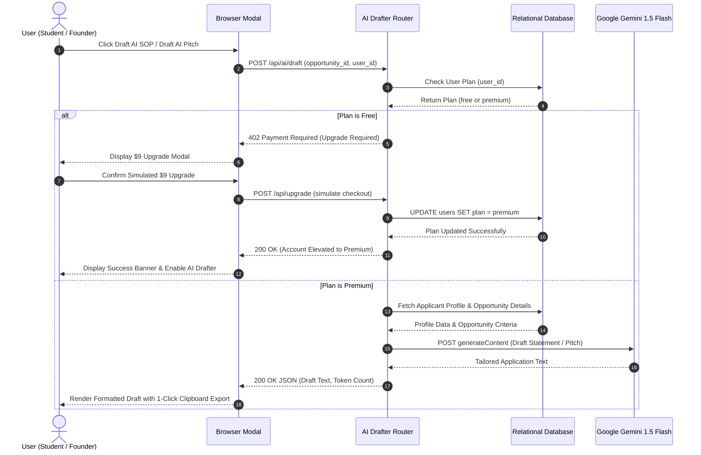

### 3.6 Persistence & Notifications (FR-7)
* **FR-7.1:** The system shall allow users to bookmark opportunities, persisting them across sessions.
* **FR-7.2:** Bookmarking an opportunity must trigger an in-app notification and an email notification via SMTP.
* **FR-7.3:** Premium Tier users must also receive an instant WhatsApp notification via Twilio Sandbox.

### 3.7 Administration & Telemetry (FR-8)
* **FR-8.1:** Administrators shall be able to create, view, and delete curated institutional opportunities.
* **FR-8.2:** The system shall log every search query with track, region, and timestamp, calculating aggregate metrics on demand.

### 3.8 Behavioral State Machine Model

#### 3.8.1 UML State Machine Diagram: User Session & Freemium State Transitions
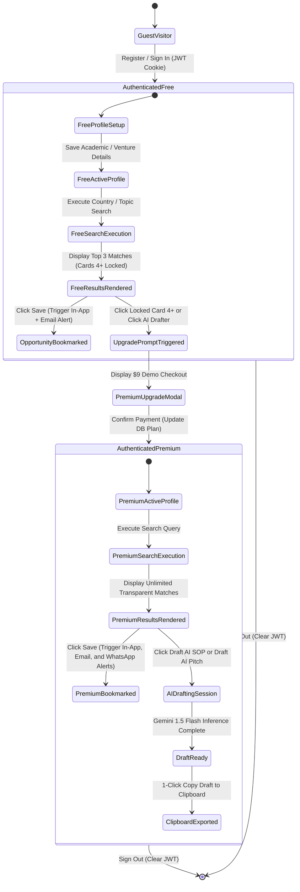

---

## 4. External Interface Requirements

### 4.1 User Interfaces
* **Landing Page (`/`):** High-conversion entry point detailing dual tracks, hybrid architecture, and freemium tiers.
* **Auth Views (`/login`, `/register`):** Minimalist authentication interfaces with role selection.
* **Student Dashboard (`/dashboard/student`):** Integrated academic profile editor, live scholarship search, match cards, saved drawer, and AI Essay assistant modal.
* **Founder Dashboard (`/dashboard/founder`):** Integrated venture profile editor, innovation grant search, match cards, saved drawer, and AI Pitch assistant modal.
* **Admin Dashboard (`/admin`):** System metrics, search telemetry breakdown, curated database editor, and registered user ledger.

### 4.2 Software Interfaces
* **Google Gemini API:** `POST https://generativelanguage.googleapis.com/v1beta/models/gemini-1.5-flash:generateContent`
* **Serper.dev Web Search API:** `POST https://google.serper.dev/search`
* **Twilio REST API:** `POST https://api.twilio.com/2010-04-01/Accounts/{AccountSid}/Messages.json`
* **SMTP Gateway:** Port 587 TLS communication via Python `smtplib`.

---

## 5. Non-Functional Requirements

### 5.1 Performance Requirements
* Server response time for static views: $< 150\text{ ms}$.
* Hybrid search pipeline completion: $< 3.5\text{ s}$.
* Memory footprint under typical load: $< 250\text{ MB}$.

### 5.2 Security Requirements
* All communications must support HTTPS/TLS encryption.
* Session tokens must be signed with HMAC-SHA256 using an environment-isolated `SECRET_KEY`.
* Passwords must be protected against brute-force and rainbow table attacks via PBKDF2 salting.
* Input fields must be sanitized to prevent Cross-Site Scripting (XSS) and SQL Injection.

### 5.3 Reliability & Availability
* The system shall maintain 99.9% uptime by isolating external API failures via automated heuristic fallbacks.
* Data integrity must be preserved through atomic SQLite/PostgreSQL transactions.

---

## 6. Data Model & Entity Specifications

### 6.1 UML Entity-Relationship Diagram (ERD)
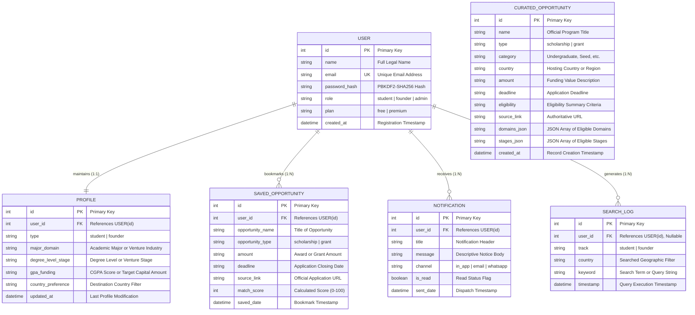

### 6.2 UML Domain Class Diagram
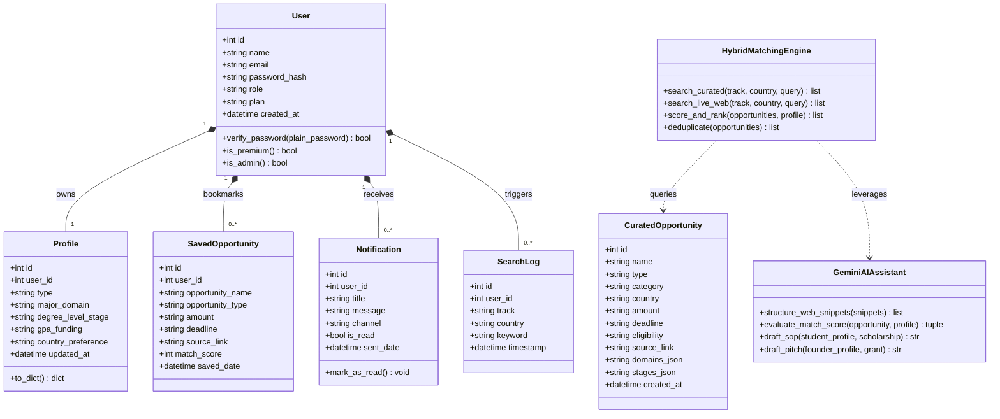

---

## 7. Verification & Acceptance Criteria
* **Acceptance Test 1:** Registering a student or founder account must issue a valid session and redirect to the corresponding dashboard.
* **Acceptance Test 2:** A search for "Pakistan" scholarships must return both curated HEC programs and live web discoveries.
* **Acceptance Test 3:** On Free Tier, results 1 to 3 must be visible, and result 4 must be locked and blurred.
* **Acceptance Test 4:** Triggering the AI essay or pitch drafter on Free Tier must return HTTP 402 with an upgrade requirement.
* **Acceptance Test 5:** Performing the $9 mock upgrade must immediately unlock unlimited results and enable the AI application drafters.
* **Acceptance Test 6:** Automated test suites must achieve a 100% pass rate with zero unresolved errors.

---

## 8. Appendix: Formal PlantUML Specifications

For cross-compatibility with formal CASE tools, PlantUML server rendering, and automated documentation generators, the corresponding PlantUML specifications for each architectural diagram are provided below.

### 8.1 PlantUML System Architecture & Component Diagram
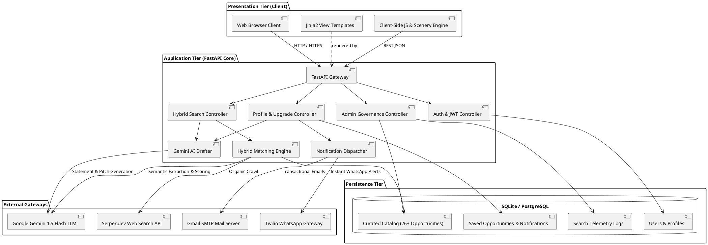

### 8.2 PlantUML Use Case Diagram
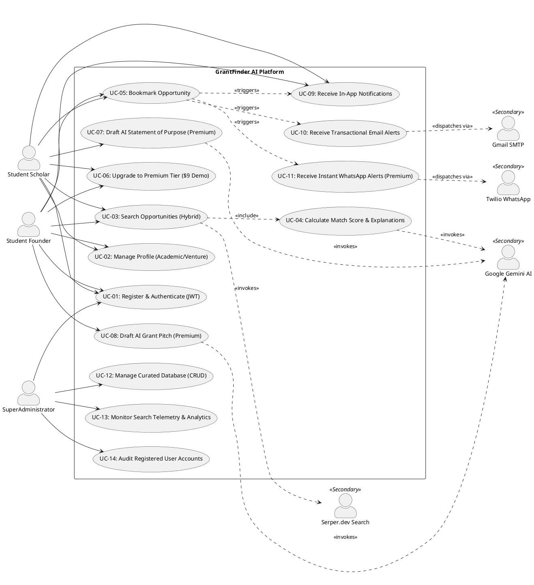

### 8.3 PlantUML Sequence Diagram: Hybrid Search & AI Matching
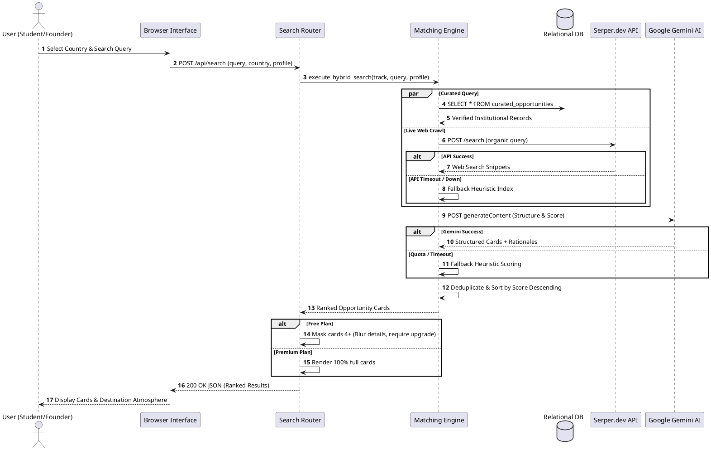

### 8.4 PlantUML Sequence Diagram: AI Assistant & Freemium Upgrade
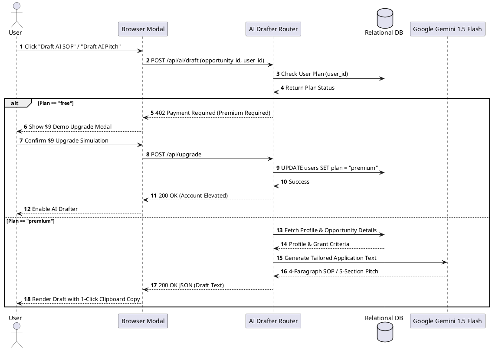

### 8.5 PlantUML State Machine Diagram: User Session Lifecycle
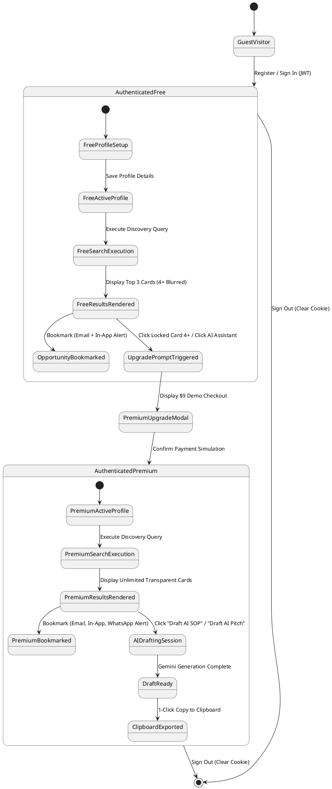

### 8.6 PlantUML Domain Class Diagram
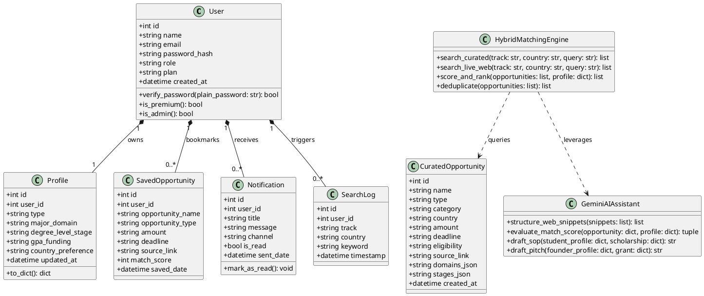

